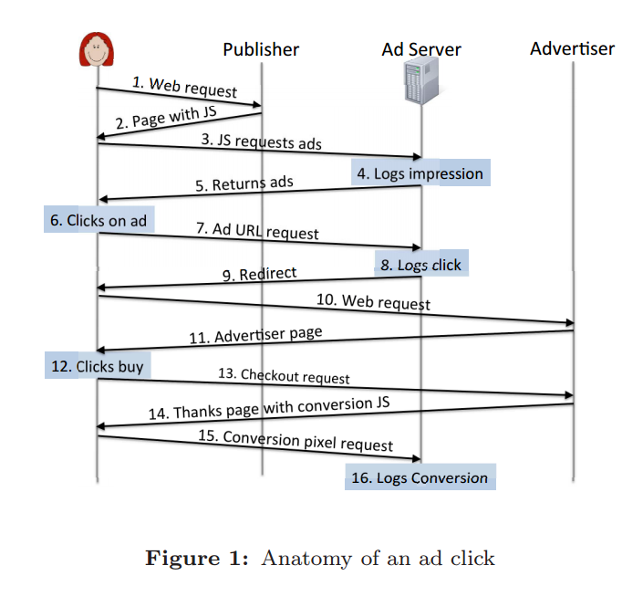

## Advertise Mode

### 1. System structure
Online search advertising has three players: *Advertises*, *Publishers*, and *ad networks*

#### Procedure
- Step 3: the JavaScript code(running in the user's browser) or PHP/Java code(running in the publisher's webserver- not shown) contacts the ad network's server to fetch a set of ads that it populates the website/app with.
- Step 4: `log impression`. The code identifies the publisher when contracting the ad network's server, which logs the request.
- Step 5: each ad returned contains a unique identifies that is used for tracking clicks on that ad.
- Step 6: user click on the ad
- Step 7: the user's browser(or app) makes an HTTP request to the ad network with the unique identifier for that ad impression
- Step 8: `log click`, the log record contains the unique identifier, which is used to lookup the ad advertiser that will be charged(and how much), the publisher that will be paid, the user that originally fetched the ad(for fraud detection), and so on. *Each single ad click is logged by the ad network*.
- Step 9-11: the HTTP response to the above request redirects the browser to the advertiser's webpage(typically using HTTP 302 response code). The ad network cannot, in general, track the user's activity on the advertiser site. An advertise can choose to embed JavaScript code provided by the ad network into certain pages( e.g., payment confirmation page, mailing list subscription page). `Me: in order to inform ad network of special action the user make on the advertiser side`
- Step 14: If the user visit the marked pages
- Step 15: the JavaSript informs the ad network that the user has performed some action deemed desirable by the advertiser.
- Step 16: `logs conversion`, the ad network uses cookies to link conversion events back to the unique identifier of the ad impression and ad click; `me: to pay the publisher money for desirable action, like buying etc.`. The conversion event may take place hours or days after the original ad clicks.
	- *conversion signal*: the ad network uses the conversion signal to provide bulk discounts to the advertiser as per the *smart-pricing* algorithm [[Smart-Pricing-2013]](https://support.google.com/adwords/answer/2604607) [[GoogleConversion-2013]](https://support.google.com/adwords/answer/93148?hl=en). The intuition behind smart-pricing is that if a publisher sends traffic that doesn't lead to desirable actions(like buying, email signups) then the traffic is not useful to the advertiser. The smart-pricing algorithm computes a penalty score for syndicated publishers. The lesser the traffic converts for that publisher, the higher the publisher's penalty score, and the more the discount offered to the advertisers for clicks on their ads when shown on that publishers' site, and thus the less the money paid out to that publisher.
	
#### 1.1 Advertiser
Advertisers are who want to advertise a product or service

#### 1.2 Publishers
Publishers run websites(search engines, new sites, blog sites), mobile apps and games that display the ads. There are two kinds of publishers, 
- *publishers owned by the ad network*, e.g., google.com shows ads from Google's ad network
	- syndicated publishers have strong financial motivation to conduct click-spam
-  *publishers operated(O&O) by the  adnetwork*, e.g., ask.com is a syndicated publisher for Google ads
	
#### 1.3 Ad Networks
Ad networks(like Google AdSense, Bing Ads, Baidu, and Tahoo) that connect advertisers with the publishers. They provide publishers a library with which to fetch ads. This may be JavaScript the publisher can embed into their website or app, or may be server-side code(e.g., PHP or java).
- focus on their long-term reputation, they are driven to filter click-spam and offer discounts to advertisers to reduce the impact of click-spam

### 2. Charching Scheme
**Cost-per-Click(CPC) or Pay-per-Click(CPC)**
It is the dominated charging model for search ads [[Parker-2012]](http://searchengineland.com/iab-pwc-search-still-tops-online-ad-revenues-and-share-grew-in-2011-118929). Advertisers pay the ad network only when their ad is clicked. Ad networks typically pay syndicated publishers 70% of the revenue generated by ad clicks on their site. 
- There are other charging models(e.g., pay per impression, pay per action), but this is not the dominate online ad revenues and ongoing trend. 

